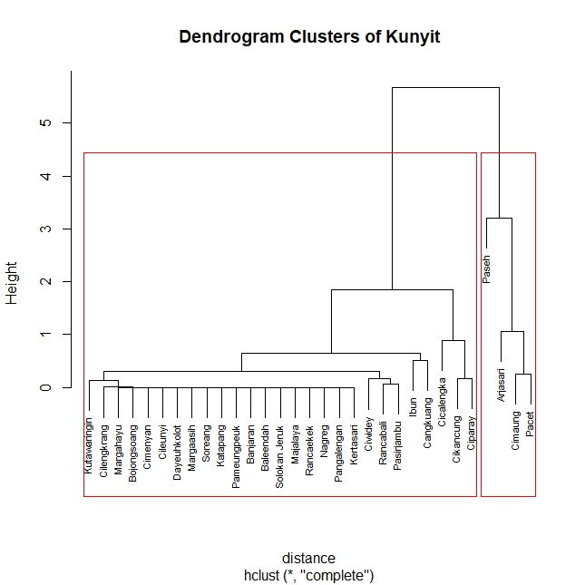

# 🌿 Complete Linkage Clustering - Data Produksi Kunyit

This project involves hierarchical clustering using the Complete Linkage method on turmeric production data across districts.  
The analysis was carried out in R, covering:
- Data preprocessing  
- Assumption checking  
- Cluster formation  
- Validation with the Silhouette Method
---

## 📊 Dataset
- **Source**: Production data of turmeric per district (`data_bio.xlsx`)  
- **Variables**:
  - Production (kg)  
  - Harvested Area (ha) 

---

## 🛠️ Tools & Packages
Implemented in **R** with the following packages: 

```r
library(dplyr)
library(REdaS) 
library(psych)
library(car)
library(cluster)
library(factoextra)
library(tidyverse)
library(readxl)
```


🔎 Methodology
1. Data preprocessing (cleaning, standardization)  
2. Calculation of distance matrix (Euclidean distance)  
3. Hierarchical clustering using Complete Linkage method  
4. Visualization of dendrogram for cluster interpretation  

📈 Results

🔗 Clustering Dendrogram



## ✅ Key Insight
- Districts with similar production and harvested area characteristics are grouped into the same cluster.  
- These findings can guide **resource allocation** and **development focus**.
